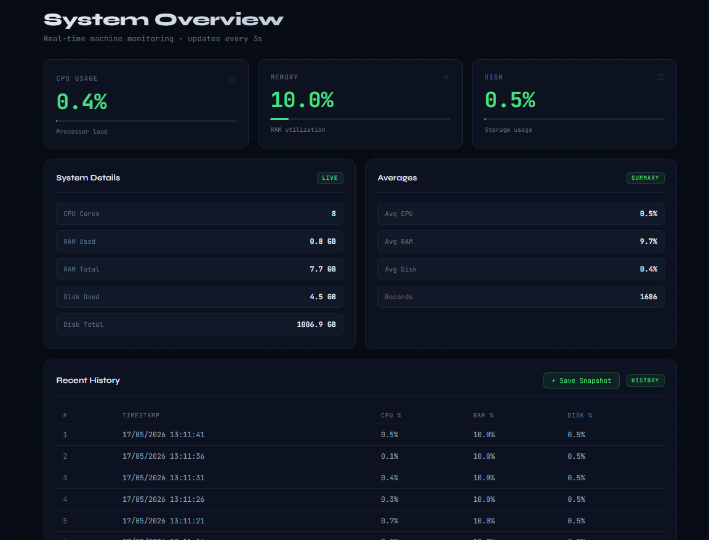

#  DevWatch 📈

API de monitoramento de sistema desenvolvida com FastAPI para coleta, armazenamento e análise de métricas em tempo real.

---

# 📸 Preview



---


# ✅ Status do Projeto

Projeto funcional e dockerizado.

Atualmente o DevWatch possui:
- Backend FastAPI
- Dashboard web
- PostgreSQL
- Docker Compose
- Coleta automática de métricas
- Histórico e estatísticas
- Comunicação entre containers

---

# 🎯 Objetivo

Construir uma API capaz de:

* Monitorar uso de CPU
* Monitorar uso de memória RAM
* Monitorar uso de disco
* Salvar métricas automaticamente no PostgreSQL
* Consultar histórico de métricas
* Aplicar paginação e filtros dinâmicos
* Gerar resumos estatísticos das métricas
* Executar monitoramento contínuo em background
* Rodar em ambiente local e Docker
* Evoluir futuramente para dashboard e alertas em tempo real
* Mostrar gráficos e dados de métricas em dashboards interativos

---

# ⚙️ Tecnologias Utilizadas

* Python
* FastAPI
* SQLAlchemy
* PostgreSQL
* Pydantic
* Uvicorn
* psutil
* python-dotenv
* Docker
* HTML
* CSS
* JavaScript
* Nginx
* Docker Compose

---

# 🖥️ Dashboard

O projeto possui interface web para visualização em tempo real das métricas do sistema.

A interface consome a API FastAPI e exibe:
- CPU
- RAM
- Disco
- Histórico
- Resumos estatísticos

---

# 🧠 Aprendizados

Este projeto foi desenvolvido com foco em:

* Estruturação de APIs com FastAPI
* Arquitetura backend organizada
* Separação de responsabilidades
* Integração com PostgreSQL via SQLAlchemy
* Persistência de dados
* Dependency Injection no FastAPI
* Validação com Pydantic
* Paginação (`limit` e `skip`)
* Filtros dinâmicos em queries
* Tratamento global de erros
* Logging no backend
* Coleta automática de métricas
* Threads/background tasks
* Variáveis de ambiente (`.env`)
* Containerização com Docker
* Orquestração de containers com Docker Compose
* Comunicação entre containers
* Integração entre frontend e backend
* Configuração de CORS no FastAPI
* Consumo de API com JavaScript (`fetch`)
* Estruturação de dashboard frontend
* Compatibilidade entre Windows e Linux

---

# 👷 Arquitetura 

```text
Frontend (Nginx)
       ↓
FastAPI Backend
       ↓
PostgreSQL
```

---

# 📂 Estrutura do Projeto

```bash
.
├── app/
│   ├── exceptions/
│   ├── frontend/
│   ├── handlers/
│   ├── models/
│   ├── routes/
│   ├── schemas/
│   ├── services/
│   └── main.py
│
├── .env.example
├── docker-compose.yml
├── Dockerfile
├── requirements.txt
└── README.md
```

---

# 📌 Funcionalidades

## 🔹 `GET /metrics`

Retorna métricas atuais do sistema em tempo real.

---

## 🔹 `POST /metrics`

Coleta e salva métricas manualmente no banco de dados.

---

## 🔹 `GET /metrics/history`

Retorna histórico de métricas com suporte a:

* Paginação
* Filtros dinâmicos
* Intervalo de datas
* Filtro de CPU mínima/máxima

### Exemplo

```bash
/metrics/history?limit=10&skip=0
```

---

## 🔹 `GET /metrics/latest`

Retorna a métrica mais recente registrada.

---

## 🔹 `GET /metrics/summary`

Retorna um resumo estatístico das métricas contendo:

* Média de CPU/RAM/Disco
* Valor máximo de CPU/RAM/Disco
* Quantidade de registros
* Filtros por período

---

## 🔹 `GET /metrics/{metric_id}`

Retorna uma métrica específica pelo ID.

---

# 🛡️ Tratamento de Erros

O projeto possui:

* Exception handlers globais
* Logs de erro com `logging`
* Rollback automático em falhas no banco
* Respostas padronizadas da API
* Proteção contra quebra do monitoramento automático

---

# 🐳 Execução com Docker

## Subir o projeto

```bash
docker compose up --build
```

Isso irá:

* Subir a API FastAPI
* Subir o PostgreSQL
* Subir o frontend do dashboard
* Conectar automaticamente os containers

---


# 🌐 Acessando a Aplicação

Após iniciar os containers, acesse:

* Frontend Dashboard: http://localhost:3000
* API Swagger Docs: http://localhost:8000/docs
* API Redoc: http://localhost:8000/redoc

---

# 🐘 Banco de Dados

O banco é criado automaticamente pelo Docker Compose.

---

# 🔐 Variáveis de Ambiente

Crie um arquivo `.env` na raiz do projeto:

```env
DB_HOST=db
DB_PORT=5432
DB_NAME=devwatch
DB_USER=postgres
DB_PASSWORD=postgres
```

---

# ⚙️ Instalação

Clone o repositório:

```bash
git clone https://github.com/MatheusRibeiro123/devwatch-api.git
cd devwatch-api
```

---

# 👨‍💻 Autor

**Matheus Ribeiro**
Desenvolvedor em formação, focado em backend com Python e construção de APIs.

Projeto desenvolvido para prática de FastAPI, Docker, PostgreSQL e arquitetura backend.
